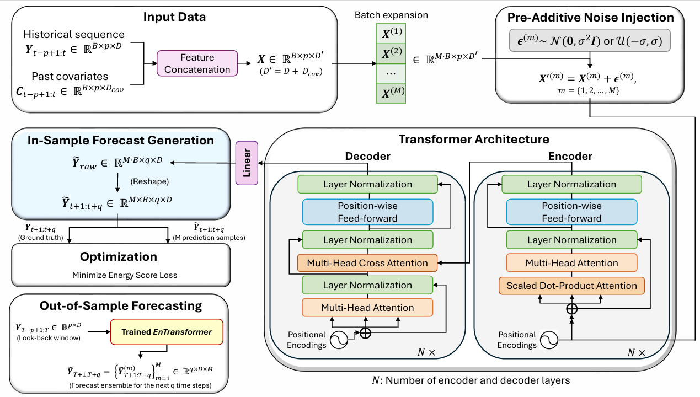

<div align="center">
  
  
  # 🚀 Genformer: Deep Generative Transformers
  **For Probabilistic Time Series and Spatiotemporal Forecasting** 📈✨
  
  [](https://pypi.org/project/genformer/)
  [](https://python.org)
  [](https://pytorch.org)
  [](https://yuvrajiro.github.io/Genformer/)
  [](LICENSE)
</div>

---

## 🌟 Introduction

Welcome to **Genformer**! 🎉 This is the official Python package for the paper:
> *"Deep Generative Transformers for Probabilistic Time Series and Spatiotemporal Forecasting"* 📝

Time series forecasting is hard, especially when dealing with uncertainty. **Genformer** brings the power of **Transformers** 🤖 together with the **Engression Paradigm** 🎲 (distributional regression) to give you:
*   ✨ **Coherent multivariate trajectories** instead of boring point predictions!
*   ⚡ **Extremely lightweight** probabilistic capabilities with constant-factor overhead.
*   🌍 **Spatiotemporal support** via Graph-Enformer (GEnformer) for when your data has geographical/spatial relationships.

---

## 🛠️ Installation

Get up and running in seconds! 🏃‍♂️💨

```bash
pip install genformer
```

Or install the latest development version from source:

```bash
git clone https://github.com/yuvrajiro/Genformer.git
cd Enformer
pip install -e .
```

---

## 💡 Quick Start

Generating probabilistic forecasts is as easy as pie 🥧:

```python
import pandas as pd
from darts import TimeSeries
from genformer.models import Enformer

# 1. Load your TimeSeries data 📊
series = TimeSeries.from_dataframe(pd.read_csv("your_data.csv"))

# 2. Initialize the awesome Enformer! 🚀
model = Enformer(
    input_chunk_length=24,
    output_chunk_length=12,
    num_samples_engression=10, # Number of ensemble samples
    n_epochs=30
)

# 3. Train & Predict 🔥
model.fit(series)
prediction = model.predict(n=12, num_samples=50)

# 4. Plot a beautiful probabilistic forecast 🌈
prediction.plot(low_quantile=0.05, high_quantile=0.95)
```

---

## 🏗️ Architecture

### 🔮 Enformer (Temporal)
Injects pre-additive stochastic noise $\epsilon \sim \mathcal{N}(0, \sigma^2 \mathbf{I})$ into the batch-expanded inputs, optimizing the strictly proper **Energy Score Loss**. 

### 🌐 Graph-Enformer (Spatiotemporal)
Extends Enformer by passing the spatial inputs through a Graph Convolutional Network (GCN) to capture intricate geographical topologies before processing temporal dependencies! 📍🗺️

---

## 📚 Documentation & Examples

📖 **Read the full documentation online: [yuvrajiro.github.io/Genformer](https://yuvrajiro.github.io/Genformer/)**

Extensive documentation is built using Sphinx and `pydata-sphinx-theme`! To build the docs locally:
```bash
cd docs
make html
# Then open _build/html/index.html in your browser! 🌐
```
Check out the `docs/examples/` directory for fully runnable Jupyter Notebooks demonstrating both temporal and spatiotemporal forecasting! 🚀

---

## 📜 Citation & Special Thanks

If you find this work useful in your research, please cite our paper:

```bibtex
@article{pathak2026deep,
  title={Deep Generative Transformers for Probabilistic Time Series and Spatiotemporal Forecasting},
  author={Pathak, Rajdeep and Goswami, Rahul and Panja, Madhurima and Ghosh, Palash and Chakraborty, Tanujit},
  journal={arXiv preprint arXiv:260307108},
  year={2026}
}
```

💖 **Special Thanks:** We would like to extend a very special thanks to **Donia Besher** for her invaluable contributions and support! 🙌

---

<div align="center">
  <i>Made with ❤️ by the Genformer Team</i>
</div>
